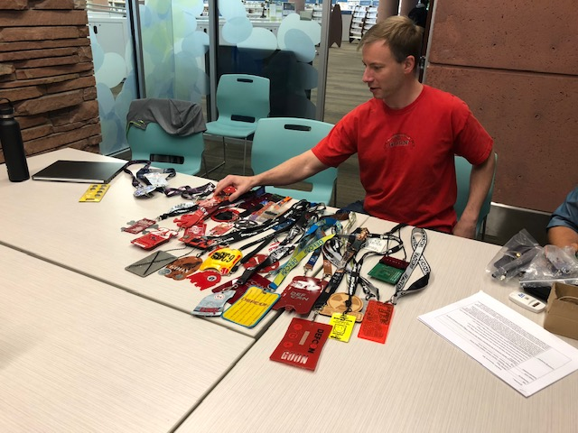
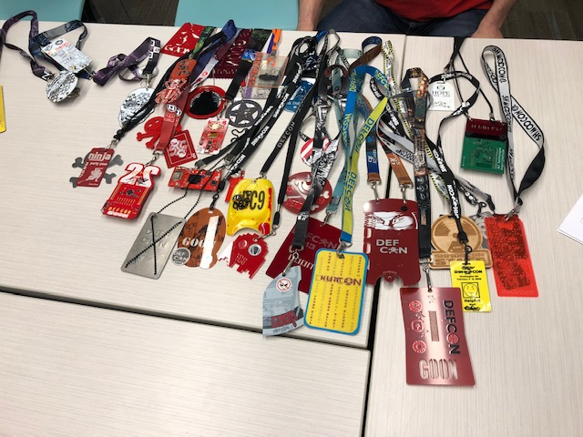

+++
title = "Badge Night"
description = ""
tags = [
    "meetings",
]
date = "2018-09-27"
categories = [
    "meetings",
]
[params]
  meetingDate = '2018-09-27T18:00:00-06:00'
  endDate = '2018-09-27T20:00:00-08:00'
  author = 'James (@punkcoder)'
+++

Tentative Room Location: 

Flagstaff Room: 6:00pm to 8:00pm Thursday, Sep 27 2018
Address: 1001 Arapahoe Ave, Boulder, CO 80302

The current format will be as follows (we are trying things out):

* 2-3 15min presentations on various topics (feel free to suggest some)
* Followed by activity time -> Previous Defcon Badge hacking (If you have any bring them along)
* Food and Drinks to follow the meeting (suggestions??)

<!--more-->
## Recap

Yet another very successful meeting of DC720.  This time we were set to do a
hacking night with badges. But, because of all of the badges, we
never really got around to the hacking part.

With 13 members in attendance we are looking forward to our next meeting in November (details below)
