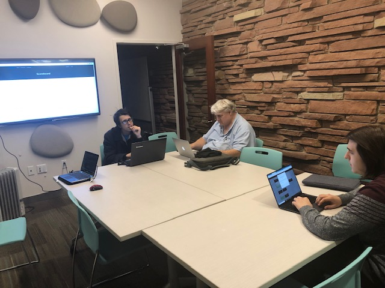

+++
title = "CTF Meeting"
description = ""
tags = [
    "meetings",
]
date = "2018-12-18"
categories = [
    "meetings",
]
[params]
  meetingDate = '2018-12-18T18:00:00-06:00'
  endDate = '2018-12-18T20:00:00-08:00'
  author = 'James (@punkcoder)'
+++

Flagstaff Room

<!--more-->

## Recap

Tonight, members of the DC720 group worked through a ctf that was designed by one
of the members of the group for application security training. We had a small
turn out becuase of changing dates and the holidays.  

