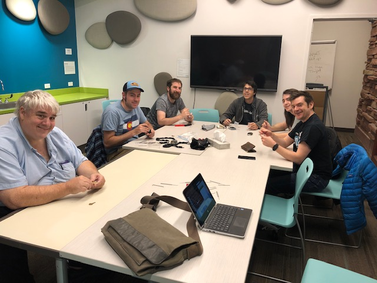

+++
title = "Lockpicking Night"
description = ""
tags = [
    "meetings",
]
date = "2018-11-06"
categories = [
    "meetings",
]
[params]
  meetingDate = '2018-11-06T18:00:00-06:00'
  endDate = '2018-11-06T20:00:00-08:00'
  author = 'James (@punkcoder)'
+++

Flagstaff Room: 6:00pm to 8:00pm Tuesday, Nov 6 2018 (first floor next to the elevator)

We will be lock picking, so bring locks you own and picks. 

As always, meetings are open to all.

<!--more-->

## Recap

Another great night of Hacker Shenanigans working on lock picking, we all had a
good time passing around locks and talking over the specifics.  Almost all of
the locks that were present got picked with the exception of one of the
"McGuckin" Branded Locks, which I picked up specifically since it said "Hard to
Pick".

For our next meeting we will be working on a Capture the Flag that is designed for training
application developers about the need for AppSec.  Please make sure that you bring a device that you can use to work on the CTF.
