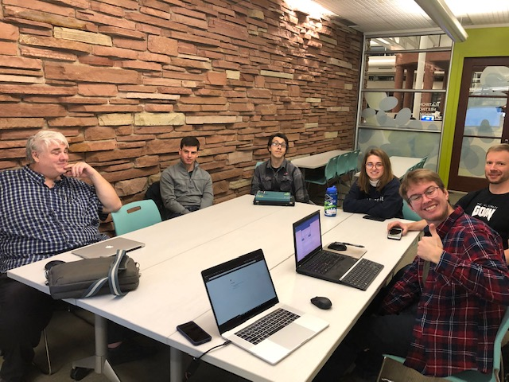

+++
title = "SQL Injection Meeting"
description = ""
tags = [
    "meetings",
]
date = "2019-01-02"
categories = [
    "meetings",
]
[params]
  meetingDate = '2019-01-02T18:00:00-06:00'
  endDate = '2019-01-02T20:00:00-08:00'
  author = 'James (@punkcoder)'
+++

Flagstaff Room: 6:00pm to 8:00pm Wednesday, Jan 2 2019 (first floor next to the elevator)

Topic: SQL injection

<!--more-->
## Recap

At tonights meeting we went over the finer points of sql injection, the dangers
and fun that can be had with it.  We had a good turn out for the event, once
again managed to mess up the room location, so the meeting page was updated with
the full details for the next couple of meetings. From the looks of it we will
soon have a logo for the DC720 group.

Additionally the website has been updated with the link for the invitation for the slack channel.  But if you missed it elsewhere please feel free to select [link](https://join.slack.com/t/boulderinfosec/shared_invite/enQtNDI0NTk0MDI4MDk3LTZjNDY0NmJkZjE3ZGRkMTU0Y2Q2YWRiYTJjN2NjMjMzZGU3MWIwMGQ0OWRjYTQ5YWI5MzcxYmYzNWY5NzkwZjgs)

